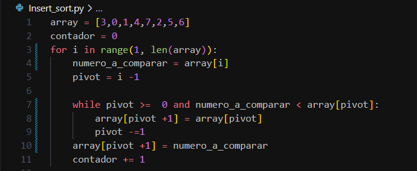

# Trabajo Práctico ordenamiento:

## :point_right: Integrantes :point_left:
- Jerónimo Córdoba 
- Valetin Corallo 
- Lautaro Alderete 
- Carlos Lopez

## :zap: Proyecto: Ordenamiento. :zap:

## :fire: Descripción :fire:
En este trabajo práctico nos tocó ver el video 1 y crear un algoritmo
para realizar insert sort de la misma forma que aparece en el video.

Ademas realizamos un algoritmo para hacer quicksort sin recursividad.

Tambien documentamos detalladamente el metodo quicksort original.
~~~ Python
    """El algoritmo de quick sort mostrado en clase lo que hace es: Con la función swap toma dos enteros, y los retorna con los valores intercambiados.
    Luego en la función particionar tenemos el pivote, que es el ultimo elemento del array,
    despues se inicializa el índice i como el menor valor menos 1 (low -1), con el bucle for recorre todos los elementos desde el más bajo (low) hasta el más 
    alto (high).
    Si un elemento es menor o igual al pivote, se incrementa i y se intercambian los elementos en array[i] y array[j].
    Luego, se intercambia el pivote con el primer elemento mayor encontrado.
    La función quicksort lo que hace es llamarse de forma recursiva dos veces, una para la subcadena de la izquierda del pivote y otra para la derecha,
    la condición continua hasta que low es mayor o igual a high"""

~~~ 
## Análisis
Llegamos a la conclusión de que el metodo quicksort e insert sort en cuestión de tiempo de ejecución son practicamente iguales, tardando una media de entre 2 y 4ms ambos, pero en cantidad de iteraciones el metodo quicksort hace menos que el insert.

El peor metodo seria el bubble o burbujeo, teniendo un resultado de 7ms y mas de 67mil iteraciones 

## :page_facing_up: Lista usada para las pruebas: :page_facing_up:
~~~ Python
array = [5,1,9,7,3,1,9,7,3,1,9,7,3,1,9,7,1,9,7,3,1,9,7,3,1,9,7,
          3,1,9,7,3,1,9,7,3,1,9,7,3,1,9,7,3,1,9,7,3,1,9,7,3,1,9,
          7,3,1,9,7,3,1,9,7,3,1,9,7,3,1,9,7,3,1,9,7,3,1,9,7,3,1,9,7,3,1,9,7,3,1,9,
          7,3,1,9,7,3,1,9,7,3,1,9,7,3,1,9,7,3,1,9,7,3,1,9,7,3,1,9,7,3,1,9,7,3,1,9,7,3,
          1,9,7,3,1,9,7,3,1,9,7,3,1,9,7,3,1,9,7,3,1,9,7,3,1,9,7,3,1,9,7,3,1,9,7,3,1,9,7,3,1,9,7,3,1,9,
          7,3,1,9,7,3,1,9,7,3,1,9,7,3,1,9,7,3,1,9,7,3,1,9,7,3,1,9,7,3,1,9,7,3,1,9,7,3,1,9,7,3,1,9,7,3,1,9,
          7,3,1,9,7,3,1,9,7,3,1,9,7,3,1,9,7,3,1,9,7,3,1,9,7,3,1,9,7,3,1,9,7,3,1,9,7,3,1,9,7,3,1,9,7,3,1,9,7,3,
          1,9,7,3,1,9,7,3,1,9,7,3,1,9,7,3,1,9,7,3,1,9,7,3,1,9,7,3,1,9,7,3,3,1,9,7,3,1,9,7,3,1,9,7,3,1,9,7,3,1,9,
          7,3,1,9,7,3,1,9,7,3,1,9,7,3,1,9,7,3,1,9,7,3,1,9,7,3,1,9,7,3,1,9,7,3,1,9,7,3,1,9,7,3,1,9,7,3]

~~~
## :skull: Conclusión del insert-sort: :skull:
Creemos que es un buen metodo para utilizar, aunque no necesariamente el más eficiente, en listas pequeñas tiene mayor eficiencia que en las más grandes

## :boom: Función principal :boom:
Ordenar un array con el metodo insert-sort

~~~ Python (lenguaje en el que esta escrito)
    array = [3,0,1,4,7,2,5,6]
    contador = 0
    for i in range(1, len(array)): 
        numero_a_comparar = array[i] 
        pivot = i -1 
        
        while pivot >=  0 and numero_a_comparar < array[pivot]: 
            array[pivot +1] = array[pivot] 
            pivot -=1 
        array[pivot +1] = numero_a_comparar 
        contador += 1
~~~

## :link: Link al proyecto :link:
insert-sort
- [proyecto insertsort](https://onlinegdb.com/WxnIJQAJU)
quicksort no recursivo
- [Proyecto quicksort no recursivo](https://onlinegdb.com/CyV4TBbLc)

---
